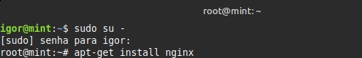
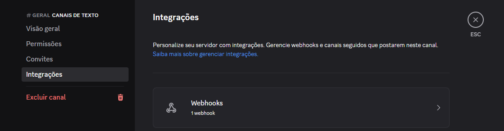
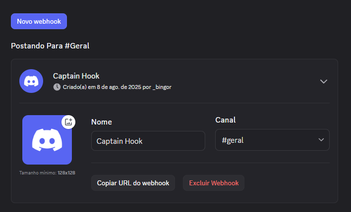
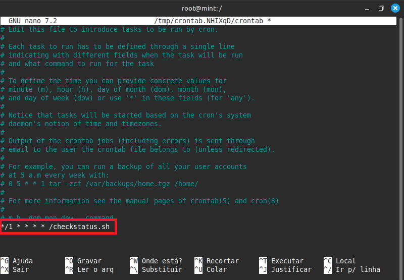
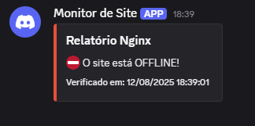
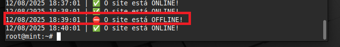

# ProjetoLinux

Projeto: Configuração de Servidor Web com Monitoramento

**Objetivo:** Desenvolver e testar habilidades em Linux e automação de processos
através da configuração de um ambiente de servidor web monitorado.

## Etapa 1: Configuração do Ambiente

### 1. Baixe a Máquina virtual https://www.virtualbox.org/wiki/Downloads

### 2. Baixe o Linux https://linuxmint.com/download.php

Após o download, faça a instalação dos programas.

## Etapa 2: Configuração do Servidor Web

### 1. No terminal, digite o comando para acessar o usuário root e, em seguida, digite sua senha:
```bash
  sudo su -
```

### 2. Após acessar como root, faça a instalação do Nginx.
```bash
  apt-get install nginx
```
 

### 3. Agora, verifique se o serviço foi iniciado.
```bash
  service nginx status
```

- Você também pode verificar acessando o IP da sua máquina virtual em seu navegador.


### Adicionando sua Página Web

### 1. Para adicionar sua página, você pode criar a sua própria ou baixar a que está neste repositório.

- Caso você não tenha o Git instalado, será necessário instalá-lo:

```bash
  apt-get install git
  git clone https://github.com/igoor1/ProjetoLinux.git
```

### 2. Agora, navegue até o diretório do repositório clonado e copie a página para a pasta padrão de arquivos web do Nginx.

```bash
  cd /ProjetoLinux/html/
  cp index.html /var/www/html/
```

### 3. Acesse novamente o IP em seu navegador e veja sua página:


## Etapa 3: Script de Monitoramento + Webhook

### Configurando o Webhook no Discord

### 1. Para criar o webhook, acesse o servidor do Discord em que você deseja receber as notificações e siga os seguintes passos:
- Servidor > Editar canal > interações > Webhooks



### 2. Selecione **Criar webhook** e copie a URL gerada.



### Configurando o Script

### 3. Após isso, acesse novamente o diretório do repositório que você clonou e mova ou copie o script de monitoramento para a raiz do sistema (/).

```bash
  cd /ProjetoLinux/script/
  cp checkscript.sh /
```

### 4. No diretório raiz (/), edite o arquivo checkstatus.sh com um editor de texto (como o vi ou nano) e adicione o link do seu webhook e o IP da máquina.

```bash
  vi checkstatus.sh
```

### 5. Após fazer suas alterações, execute este comando para transformar o arquivo em um executável.

```bash
  chmod +x checkstatus.sh
```


### 6. Crie o arquivo que irá armazenar os logs do seu script.

```bash
  touch /var/log/monitoramento.log
```

### 7. Agora, para testar o script, vamos desativar o Nginx e executar o script manualmente.

```bash
  service nginx stop
```

```bash
 ./checkstatus.sh
```

- Se tudo estiver correto, uma notificação aparecerá via Discord!


### 8. Agora, precisamos automatizar o script para que ele seja executado a cada minuto. Para isso, vamos usar o **Cron**.

- Instale o Cron (caso não esteja instalado):
```bash
  apt-get install cron
```

- Inicie e habilite o serviço:
```bash
  systemctl enable cron
```

- Use o comando abaixo para editar o arquivo crontab e agendar a tarefa:
```bash
  crontab -e
```

- Adicione a seguinte linha ao final do arquivo para que o script execute a cada minuto:

```bash
  */1 * * * * /checkstatus.sh
```
 

- Agora, acesse o arquivo de log e verifique se o script está sendo executado corretamente a cada minuto.

```bash
  cat /var/log/monitoramento.log
```

Este será o resultado:

 


## Etapa 4: Automação e Testes

 -Agora, vamos verificar se o script de monitoramento, o alerta e a reinicialização automática estão funcionando como esperado.

### 1. Como funciona o script de monitoramento:

- Link do webHook do discord:
```bash
DISCORD_WEBHOOK_URL="SEU URL AQUI!"
```

- Caminho do arquivo de Log:
- Define o local onde os registros de status serão salvos.

```bash
LOG_FILE="/var/log/monitoramento.log"
```
 - Função responsável por enviar as mensagens para o Discord. Ela constrói um corpo de mensagem no formato JSON, inserindo a mensagem de status e a data atual, e o envia para a URL do Webhook usando `curl`:
```bash
enviar_notificacao(){
    local message="$1"

    local json_payload
    json_payload=$(printf '{
    "username": "Monitor de Site", "embeds": [{"title": "Relatório Nginx", "description": "%s", "color": 15158332, "footer": {"text": "Verificado em: %s"}}]}' "$message" "$(date '+%d/%m/%Y %H:%M:%S')")

    curl -H "Content-Type: application/json" -d "$json_payload" "$DISCORD_WEBHOOK_URL"
}
```

- Verificação de Status HTTP:
```bash
STATUS=$(curl -s -o /dev/null -w "%{http_code}" 192.168.1.1 )
```

Este trecho do script é uma estrutura condicional if-else para verificar o resultado da requisição HTTP.

### Cenário de Sucesso

```bash 
if [ "$STATUS" -eq 200 ]; then
    SITE_STATUS="✅ O site está ONLINE!"
    echo "$(date '+%d/%m/%Y %H:%M:%S') | $SITE_STATUS" >> "$LOG_FILE"
```
- caso seja 200, o script salva a mensagem de "ONLINE" no arquivo log com a data e hora.

### Cenario de falha

```bash
else 
    SITE_STATUS="⛔ O site está OFFLINE!"
    echo "$(date '+%d/%m/%Y %H:%M:%S') | $SITE_STATUS" >> "$LOG_FILE"
    enviar_notificacao "$SITE_STATUS" "error"

    service nginx restart
fi
```
- Caso a condicão no IF seja falsa, executa este bloco onde registra a mensagem de falha no arquivo, notifica o discord chamando a função  e executa o comando para tentar reiniciar o servidor.

### 2. Automação

A automação foi aplicada de 2 formas no projeto:  
- Utilizando o cron para executar as verificações a cada minuto
```bash
  */1 * * * * /checkstatus.sh
```

- No script onde foi adicionado uma função para reiniciar o servidor em caso de falha.
```bash
    service nginx restart
```

### 3. testes

 - Forcamos a parada do Nginx com:
 ```bash
    service nginx stop
```
  
- Após um minuto o script é executado novamente e detecta a queda do servidor enviando uma notificação para o discord:

 

 - Registros de log após queda e reinicialização do servidor:

  