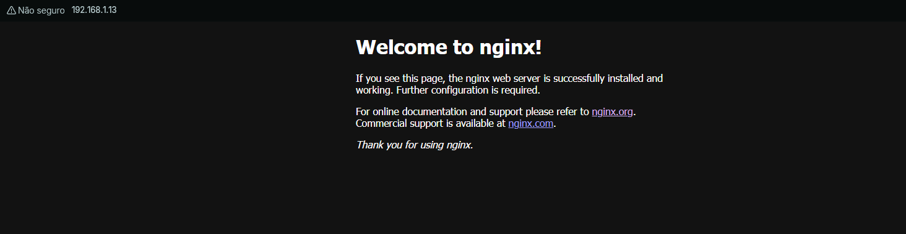
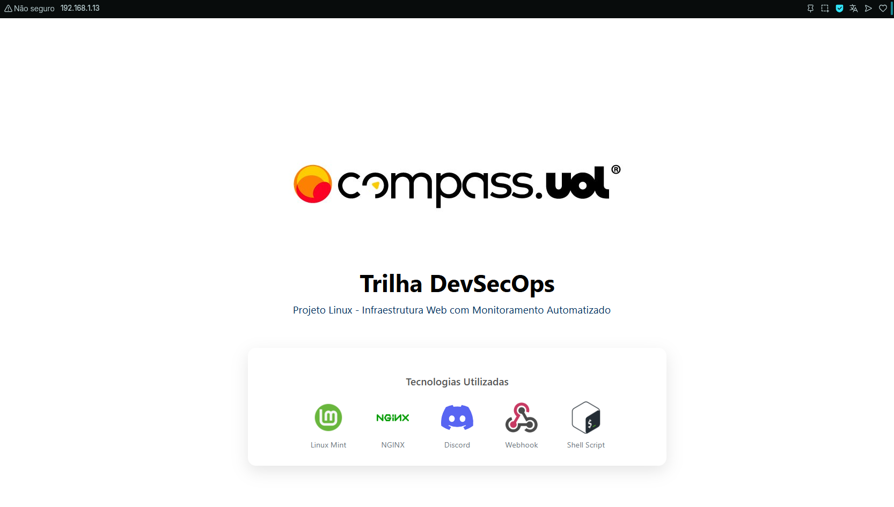
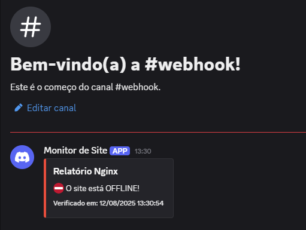
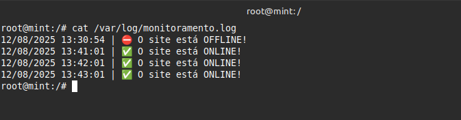

# ProjetoLinux

Infraestrutura Web com Monitoramento Automatizado 

## Etapa 1: Configuração do Ambiente

Baixe a Máquina virtual https://www.virtualbox.org/wiki/Downloads

Baixe o Linux https://linuxmint.com/download.php

Após o download, faça a instalação dos programas.

## Etapa 2: Configuração do Servidor Web

1. No terminal, digite o comando para acessar o usuário root e, em seguida, digite sua senha:
```bash
  sudo su -
```

2. Após acessar como root, faça a instalação do Nginx.
```bash
  apt-get install nginx
```

3. Agora, verifique se o serviço foi iniciado.
```bash
  service nginx status
```

- Você também pode verificar acessando o IP da sua máquina virtual em seu navegador.



## Etapa 2: Configuração do Servidor Web

Adicionando sua Página Web

1. Para adicionar sua página, você pode criar a sua própria ou baixar a que está neste repositório.

- Caso você não tenha o Git instalado, será necessário instalá-lo:

```bash
  apt-get install git
  git clone https://github.com/igoor1/ProjetoLinux.git
```

2. Agora, navegue até o diretório do repositório clonado e copie a página para a pasta padrão de arquivos web do Nginx.

```bash
  cd /ProjetoLinux/html/
  cp index.html /var/www/html/
```

3. Acesse novamente o IP em seu navegador e veja sua página:



## Etapa 3: Script de Monitoramento + Webhook

1. Para criar o webhook, acesse o servidor do Discord em que você deseja receber as notificações e siga os seguintes passos:
- Servidor > Editar canal > interações > Webhooks


2. Selecione **Criar webhook** e copie a URL gerada.


3. Após isso, acesse novamente o diretório do repositório que você clonou e mova ou copie o script de monitoramento para a raiz do sistema (/).

```bash
  cd /ProjetoLinux/script/
  cp checkscript.sh /
```

4.No diretório raiz (/), edite o arquivo checkstatus.sh com um editor de texto (como o vi ou nano) e adicione o link do seu webhook e o IP da máquina.

```bash
  vi checkstatus.sh
```

5. Após fazer suas alterações, execute este comando para transformar o arquivo em um executável.

```bash
  chmod +x checkstatus.sh
```


6. Crie o arquivo que irá armazenar os logs do seu script.

```bash
  touch /var/log/monitoramento.log
```

7. Agora, para testar o script, vamos desativar o Nginx e executar o script manualmente.

```bash
  service nginx stop
```

```bash
 ./checkstatus.sh
```
- Se tudo estiver correto, uma notificação aparecerá via Discord!



8. Agora, precisamos automatizar o script para que ele seja executado a cada minuto. Para isso, vamos usar o **Cron**.

- Instale o Cron (caso não esteja instalado):
```bash
  apt-get install cron
```

- Inicie e habilite o serviço:
```bash
  systemctl enable cron
```

- Use o comando abaixo para editar o arquivo crontab e agendar a tarefa:
```bash
  crontab -e
```

- Adicione a seguinte linha ao final do arquivo para que o script execute a cada minuto:

```bash
  */1 * * * * /checkstatus.sh
```

- Agora, acesse o arquivo de log e verifique se o script está sendo executado corretamente a cada minuto.

```bash
  cat /var/log/monitoramento,log
```

Este será o resultado:

 


